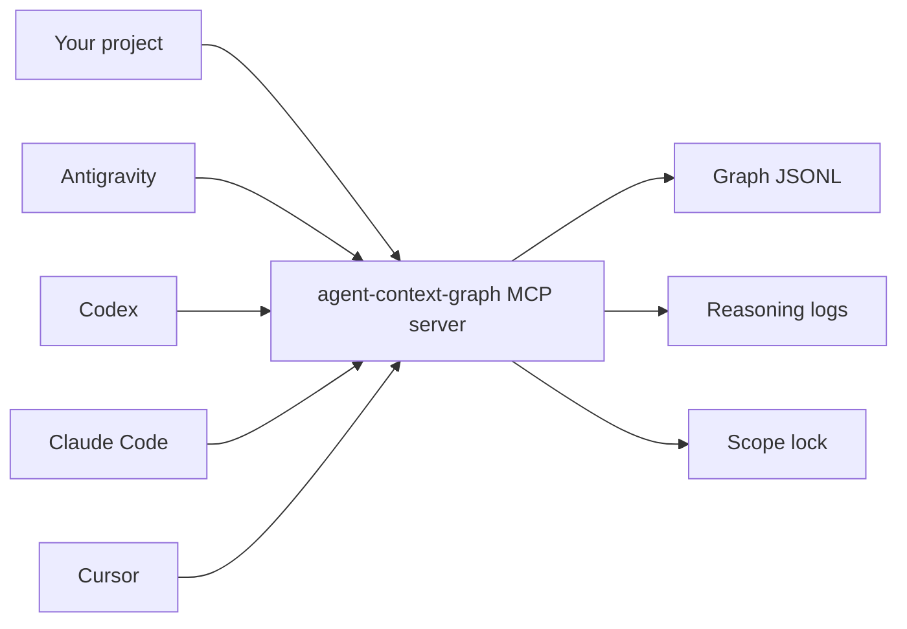

# agent-context-graph

`agent-context-graph` is a local MCP server for AI coding agents. It helps tools such as Antigravity, Codex, Claude Code, and Cursor understand a project before editing it.

It provides:

- a local code knowledge graph
- scope checks before file edits
- append-only reasoning logs
- local best-practice notes for testing, security, APIs, auth, and architecture

Everything runs on your machine. There is no SaaS backend, telemetry, analytics, GitHub API call, or runtime network call.



## Requirements

- Node.js 20 or newer
- npm
- Git
- Windows, macOS, or Linux

## Install Once

Clone this tool anywhere convenient, not inside every app project but in user-profile for global access

```bash
git clone https://github.com/Raviraj2024/Agent-Context-Graph.git
cd Agent-Context-Graph
npm install
npm run build
npm test
npm link
```

After `npm link`, this command should work from any folder:

```bash
agent-context-graph status
```

Recommended folder layout:

```text
Projects/
  Agent-Context-Graph/   # this tool
  my-app/                # your real project
```

## Use In A Project

Go to the project you want an AI tool to work on:

```bash
cd /path/to/my-app
agent-context-graph init
agent-context-graph status
```

This creates:

```text
my-app/
  .agent-context-graph/
    config.json
    graph/
    logs/
```

Run `agent-context-graph init` once per project.

## Antigravity Setup

Use Antigravity's MCP config format:

```json
{
  "mcpServers": {
    "agent-context-graph": {
      "command": "agent-context-graph",
      "args": ["serve"],
      "env": {
        "AGENT_CONTEXT_GRAPH_ROOT": "/absolute/path/to/my-app"
      }
    }
  }
}
```

Windows example[RECOMMENDED]:

```json
{
  "mcpServers": {
    "agent-context-graph": {
      "command": "agent-context-graph",
      "args": ["serve"],
      "env": {
        "AGENT_CONTEXT_GRAPH_ROOT": "C:/Users/<USER-PROFILE>/.../my-app"
      }
    }
  }
}
```

If you do not use `npm link`, use Node directly:

```json
{
  "mcpServers": {
    "agent-context-graph": {
      "command": "node",
      "args": [
        "C:/Users/<USER_PROFILE>/agent-context-graph/dist/bin/agent-context-graph.js",
        "serve"
      ],
      "env": {
        "AGENT_CONTEXT_GRAPH_ROOT": "C:/Users/<USER-PROFILE>/.../my-app"
      }
    }
  }
}
```

Restart Antigravity after saving the MCP config.

## Codex, Claude Code, Cursor

Inside your target project, run only the command for the platform you use:

```bash
agent-context-graph connect codex
agent-context-graph connect claude-code
agent-context-graph connect cursor
```

These commands write project-local MCP config files:

- Codex: `.codex/config.toml`
- Claude Code: `.claude/mcp.json`
- Cursor: `.cursor/mcp.json`

## Prompt To Use

Use this kind of prompt in Antigravity or any other coding agent:

```text
Use the agent-context-graph MCP server before editing.
First inspect the project graph, refresh it, query relevant best practices,
declare the task scope, check scope before edits, and record every change.

Before your final answer, run the actual app/test command yourself.
If the command fails because a dependency is missing, fix it if safely in scope
or report the exact blocker. Do not give me an untested run command.

Now implement: <your task>
```

## How The Agent Should Work

The MCP server tells the agent to:

1. inspect the project graph
2. refresh stale graph data
3. read relevant best-practice notes
4. declare what files or nodes it plans to change
5. check scope before every write
6. ask the user before sensitive or out-of-scope edits
7. record each change with reasoning
8. run the real app/test command before final response

The server cannot force every AI platform to obey, but these instructions are exposed through MCP so the agent can follow them automatically.

## Useful Commands

```bash
agent-context-graph init
agent-context-graph status
agent-context-graph serve
agent-context-graph reset
agent-context-graph connect codex
agent-context-graph connect claude-code
agent-context-graph connect cursor
```

- `init`: build the graph for the current project
- `status`: show graph/cache status
- `serve`: start the MCP server
- `reset`: rebuild the local SQLite cache
- `connect`: add MCP config for a supported client

## MCP Tools

The server exposes these tools:

- `get_project_overview`
- `init_or_refresh_graph`
- `get_node_context`
- `get_blast_radius`
- `get_definitive_path`
- `query_best_practices`
- `declare_task_scope`
- `check_scope`
- `record_change`
- `get_node_history`

## What To Commit

Commit these files from your target project:

```text
.agent-context-graph/config.json
.agent-context-graph/graph/nodes.jsonl
.agent-context-graph/graph/edges.jsonl
.agent-context-graph/logs/*.jsonl
.agent-context-graph/change-index.json
```

Ignore these files:

```gitignore
.agent-context-graph/cache.sqlite
.agent-context-graph/cache.sqlite-*
.agent-context-graph/.lock
```


## Supported Code

Current indexing support:

- TypeScript and TSX
- JavaScript and JSX
- Python

The graph stores signatures, docstrings, line numbers, tags, and hashes. It does not store full source code bodies.

## Troubleshooting

### `agent-context-graph` command not found

Run this from the cloned tool repo:

```bash
npm link
```

Or use the direct Node command shown in the Antigravity setup.

### Antigravity connects but sees the wrong project

Check this value:

```json
"AGENT_CONTEXT_GRAPH_ROOT": "/absolute/path/to/my-app"
```

It must point to the project you want Antigravity to edit.

### Graph is empty

Run this inside your target project:

```bash
agent-context-graph init
```

### Cache looks broken

Run:

```bash
agent-context-graph reset
```

This only removes the rebuildable SQLite cache. It does not delete graph snapshots or logs.

### `npm install` fails on `better-sqlite3`

Use Node.js 20 or newer. If npm tries to compile `better-sqlite3`, install your platform's normal C/C++ build tools and rerun:

```bash
npm install
```

## Development

```bash
npm install
npm run build
npm test
```

## License

MIT
