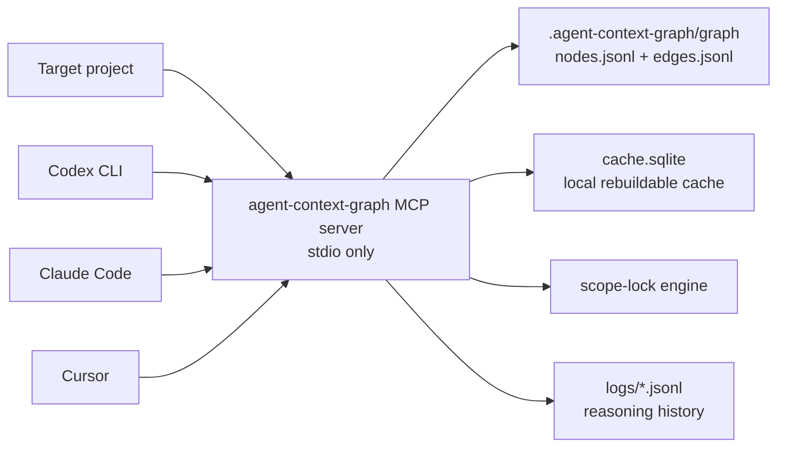

# agent-context-graph

`agent-context-graph` is a 100% local MCP server for AI coding agents working inside a codebase. It builds a compact knowledge graph of files and symbols, enforces declared edit scope before writes, and records append-only reasoning logs so future agents and maintainers can understand why changes happened.

No frontend is required. The human-facing interface is this README plus the command-line tool.



## Privacy & Local-First Guarantee

Everything runs on the user's machine. There is no SaaS service, telemetry, analytics, update check, crash reporting, GitHub API call, or external runtime API call. The only intended network activity is dependency installation through `npm install`.

The test suite includes `test/noNetwork.test.ts`, which scans compiled JavaScript for forbidden runtime network APIs.

## Requirements

- Node.js 20 or newer.
- npm.
- Git, if you are cloning from GitHub.
- Windows, macOS, or Linux.

This project uses `better-sqlite3`, a native Node package. Most users should receive a prebuilt binary during `npm install`. If npm has to build it locally, your machine may need normal C/C++ build tools for your platform.

## Quick Start From GitHub

Clone the repository:

```bash
git clone https://github.com/Raviraj2024/Agent-Context-Graph.git
cd agent-context-graph
```

Install dependencies and build:

```bash
npm install
npm run build
npm test
```

Run the CLI from the cloned repo:

```bash
node dist/bin/agent-context-graph.js status
```

For easier local testing, link the command globally on your machine:

```bash
npm link
```

After linking, this should work from any directory:

```bash
agent-context-graph status
```

To remove the local global link later:

```bash
npm unlink -g agent-context-graph
```

## Use It In A Target Project

A target project is the codebase you want an AI coding agent to work on.

Go to that project:

```bash
cd /path/to/your/target-project
```

Initialize the graph:

```bash
agent-context-graph init
```

Check status:

```bash
agent-context-graph status
```

Connect your MCP client:

```bash
agent-context-graph connect codex
agent-context-graph connect claude-code
agent-context-graph connect cursor
```

You only need to run the connect command for the client you actually use. The command merges an MCP server entry into the project-local config file for that client.

Start the server manually for a smoke test:

```bash
agent-context-graph serve
```

In normal use, your MCP client starts `agent-context-graph serve` for you.

## If You Do Not Want To Use npm link

You can run the built CLI directly from the cloned repository.

From a target project:

```bash
node /absolute/path/to/agent-context-graph/dist/bin/agent-context-graph.js init
node /absolute/path/to/agent-context-graph/dist/bin/agent-context-graph.js status
node /absolute/path/to/agent-context-graph/dist/bin/agent-context-graph.js connect codex
```

On Windows PowerShell, an example path looks like:

```powershell
node C:\Users\you\Projects\agent-context-graph\dist\bin\agent-context-graph.js init
```

## Client Setup

### Antigravity

Antigravity is an agent-first IDE, so it is a good place to test this project. The exact MCP settings screen or config path may vary by Antigravity version, but the server values are the same anywhere MCP stdio servers are supported.

First prepare this tool:

```bash
git clone <agent-context-graph-repo-url>
cd agent-context-graph
npm install
npm run build
npm link
```

Then go to the project you want Antigravity to work on:

```bash
cd /path/to/your/target-project
agent-context-graph init
```

In Antigravity's MCP server settings, add a stdio server with these values:

```json
{
  "name": "agent-context-graph",
  "command": "agent-context-graph",
  "args": ["serve"],
  "cwd": "/absolute/path/to/your/target-project"
}
```

If you do not use `npm link`, use the direct Node command instead:

```json
{
  "name": "agent-context-graph",
  "command": "node",
  "args": ["/absolute/path/to/agent-context-graph/dist/bin/agent-context-graph.js", "serve"],
  "cwd": "/absolute/path/to/your/target-project"
}
```

On Windows, use escaped backslashes or forward slashes in JSON paths:

```json
{
  "name": "agent-context-graph",
  "command": "node",
  "args": ["C:/Users/you/Projects/agent-context-graph/dist/bin/agent-context-graph.js", "serve"],
  "cwd": "C:/Users/you/Projects/my-target-project"
}
```

Restart Antigravity after adding the MCP server. Then use a prompt like:

```text
Use the agent-context-graph MCP server before editing.
First call get_project_overview, init_or_refresh_graph, query relevant best practices,
declare the task scope, check scope before edits, record every change,
and run the actual app/test command before your final answer.
If the run command fails because a dependency or command is missing, fix it in scope
or report the blocker clearly. Do not give me an untested run command.

Now implement: <your task>
```

For example:

```text
Use the agent-context-graph MCP server before editing.
First call get_project_overview, init_or_refresh_graph, query relevant best practices,
declare the task scope, check scope before edits, record every change,
and run the actual app/test command before your final answer.
If the run command fails because a dependency or command is missing, fix it in scope
or report the blocker clearly. Do not give me an untested run command.

Now add password reset support to the auth module.
```

If Antigravity shows the MCP server as connected, the agent should be able to call the graph, scope-lock, and logging tools automatically during development.

### Codex

From your target project:

```bash
agent-context-graph connect codex
```

This writes or updates:

```text
.codex/config.toml
```

It adds an MCP server named `agent-context-graph` with `serve` as the command.

### Claude Code

From your target project:

```bash
agent-context-graph connect claude-code
```

This writes or updates:

```text
.claude/mcp.json
```

### Cursor

From your target project:

```bash
agent-context-graph connect cursor
```

This writes or updates:

```text
.cursor/mcp.json
```

## Expected Agent Workflow

MCP clients read the server instructions at session start. The intended workflow is:

1. Call `get_project_overview`.
2. Call `init_or_refresh_graph`.
3. Call `query_best_practices` for the relevant domain before implementing.
4. Call `declare_task_scope` before editing files.
5. Call `check_scope` before every file write.
6. Stop and ask the user if a proposed change returns `needs_approval` or `hard_stop`.
7. Call `record_change` immediately after every create, modify, or delete.
8. Run the actual build, test, or start command needed to verify the result.
9. If verification fails because a dependency or command is missing, fix it when safely in scope or report the exact blocker in the final answer.

The server does not show its own approval prompt. It returns structured decisions so the host agent can ask the human.

For generated apps or games, the agent should not simply invent a command and hand it to the user. It should run the command itself, catch dependency problems such as `uvicorn` not being installed, and either add the dependency to the project setup or switch to a working built-in command.

## CLI Reference

```bash
agent-context-graph init
agent-context-graph connect <codex|claude-code|cursor>
agent-context-graph serve
agent-context-graph status
agent-context-graph reset
```

- `init`: scans the current project, writes defaults, builds the graph snapshot, loads standards, and populates the local SQLite cache.
- `connect <codex|claude-code|cursor>`: merges an MCP server entry into the selected project-local client config.
- `serve`: starts the stdio MCP server.
- `status`: prints snapshot/cache counts and cache metadata.
- `reset`: deletes only `cache.sqlite`, then rebuilds cache state from the snapshot/current files.

## MCP Tools

- `get_project_overview`: root node, detected stack, entry points, and node/edge counts.
- `init_or_refresh_graph`: builds or refreshes the graph and reports changed files.
- `get_node_context`: returns one node plus immediate incoming/outgoing edges.
- `get_blast_radius`: traverses calls/imports/inherits with static and inferred results separated.
- `get_definitive_path`: returns an ordered minimal change path for rename, signature, delete, or logic changes.
- `query_best_practices`: returns bundled standard nodes for a requested domain.
- `declare_task_scope`: creates the scope an agent intends to edit.
- `check_scope`: classifies proposed writes as auto-allowed, needs approval, or hard stop.
- `record_change`: appends a scrubbed reasoning log entry after a file mutation.
- `get_node_history`: returns compact prior reasoning for a node or path.

## Project Data Directory

When used inside a target project, this tool creates `.agent-context-graph/`:

- `config.json`: project-local configuration.
- `graph/nodes.jsonl`: canonical committed graph nodes.
- `graph/edges.jsonl`: canonical committed graph edges.
- `logs/<timestamp>__<session-id>.jsonl`: committed append-only reasoning logs.
- `change-index.json`: compact per-path history.
- `cache.sqlite`: local rebuildable cache, do not commit.
- `.lock`: temporary cache write lock, do not commit.

Target projects should commit:

```text
.agent-context-graph/config.json
.agent-context-graph/graph/nodes.jsonl
.agent-context-graph/graph/edges.jsonl
.agent-context-graph/logs/*.jsonl
.agent-context-graph/change-index.json
```

Target projects should ignore:

```gitignore
.agent-context-graph/cache.sqlite
.agent-context-graph/cache.sqlite-*
.agent-context-graph/.lock
```

## Supported Source Files

The initial adapters index:

- TypeScript: `.ts`, `.tsx`
- JavaScript: `.js`, `.jsx`, `.mjs`, `.cjs`
- Python: `.py`

The graph stores signatures, docstrings, line ranges, tags, and hashes. It never stores full file contents or full function bodies.

The default scanner skips `node_modules`, `.git`, common build output folders, binary files, `.agent-context-graph`, and files larger than 1 MB.

## Best-Practices Knowledge Base

The server includes local markdown standards under `src/knowledgeBase/content/` for:

- backend architecture
- API design
- auth and RBAC
- security
- testing strategy
- error handling and observability
- data modeling

These are loaded into the graph as `standard` nodes and returned by `query_best_practices`.

## Verifying A Clone

After cloning and building this repository, run:

```bash
npm run build
npm test
```

Expected result:

```text
Test Files  7 passed
Tests       10 passed
```

You can also test `init` against a temporary project:

```bash
cd /path/to/some/project
agent-context-graph init
agent-context-graph status
```

You should see `.agent-context-graph/config.json`, `.agent-context-graph/graph/nodes.jsonl`, and `.agent-context-graph/graph/edges.jsonl`.

## Troubleshooting

### `agent-context-graph` command not found

Run this from the cloned repo:

```bash
npm link
```

Or use the direct Node command:

```bash
node /absolute/path/to/agent-context-graph/dist/bin/agent-context-graph.js status
```

### `npm install` fails on `better-sqlite3`

Use Node 20 or newer. If your Node version is very new and a prebuilt binary is not available, npm may try to compile locally. Install your platform's native build tools, then rerun:

```bash
npm install
```

On Windows, this may require Visual Studio Build Tools with C++ support. On macOS, this may require Xcode Command Line Tools. On Linux, this may require Python, make, and a C++ compiler.

### `status` shows no graph nodes

Run:

```bash
agent-context-graph init
```

Make sure you are inside the target project, not inside an unrelated parent directory.

### MCP client does not show the server

Run the relevant connect command again from the target project:

```bash
agent-context-graph connect codex
```

Then restart the MCP client so it reloads local config.

### Cache looks stale or broken

Run:

```bash
agent-context-graph reset
```

This removes only the rebuildable SQLite cache. It does not delete graph JSONL snapshots or logs.

## Design Decisions

- Incremental refresh reports changed files, then rebuilds the graph snapshot in one pass. This keeps v1 deterministic and avoids stale cross-file import edges while preserving the external refresh contract.
- Parser adapters are isolated behind `LanguageAdapter`. The current adapters use conservative syntax scanning and include `web-tree-sitter` as the required parser dependency so WASM grammar-backed extraction can be expanded without changing graph or server code.
- Connector commands write project-local config files (`.codex/config.toml`, `.claude/mcp.json`, `.cursor/mcp.json`) and merge only the `agent-context-graph` entry.
- The graph schema has no body/content field. Only signatures, docstrings, line ranges, tags, and hashes are persisted.

## Adding a Language Adapter

1. Add a new adapter in `src/parsers/` that implements `LanguageAdapter`.
2. Return file/symbol nodes with stable qualified names and `contains` edges from file to symbols.
3. Keep source bodies out of nodes and edges.
4. Register the adapter in `src/parsers/index.ts`.
5. Add fixture coverage in `test/fixtures/` and parser tests.

## Development

```bash
npm install
npm run build
npm test
```

The test suite covers path safety, parser extraction, graph refresh, scope-lock precedence, secret scrubbing, lock handling, and the no-runtime-network static check.

## License

MIT
