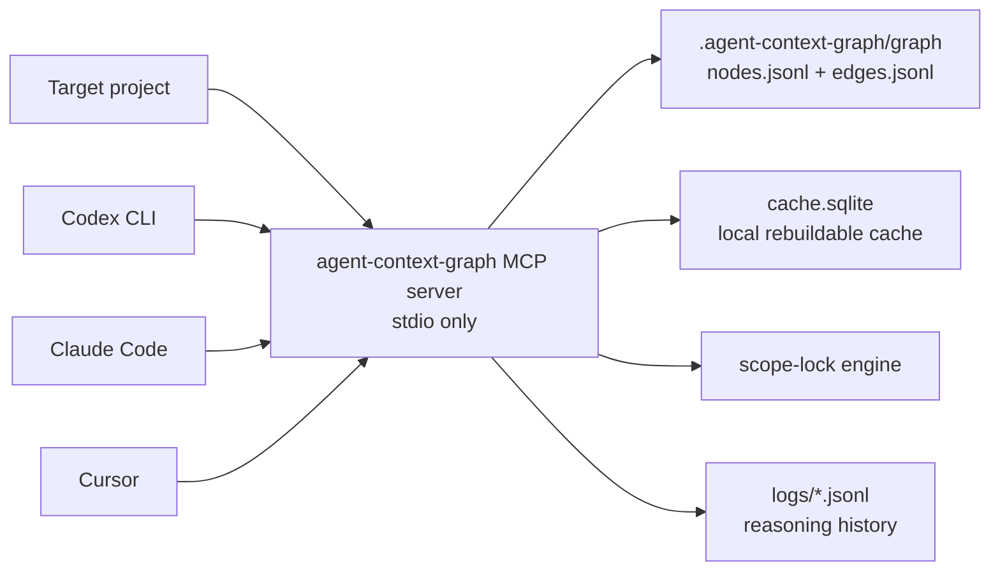

# agent-context-graph

`agent-context-graph` is a local MCP server for AI coding agents working inside a codebase. It builds a compact, queryable knowledge graph of files and symbols, enforces declared edit scope before file writes, and records append-only reasoning logs so future agents and maintainers can understand why changes were made.



## Privacy & Local-First Guarantee

Everything runs on the user's machine. There is no SaaS service, telemetry, analytics, update check, crash reporting, GitHub API call, or external runtime API call. The only intended network activity is `npm install` fetching dependencies. The test suite includes a compiled-output static check in `test/noNetwork.test.ts` that fails if forbidden runtime network APIs are emitted.

## Install

```bash
npm install
npm run build
```

Inside a target project:

```bash
npx agent-context-graph init
npx agent-context-graph connect codex
npx agent-context-graph connect claude-code
npx agent-context-graph connect cursor
```

`agent-context-graph serve` starts the stdio MCP server. It is also the default command when no subcommand is provided.

## CLI

- `init`: scans the current project, writes defaults, builds the graph snapshot, and populates the local cache.
- `connect <codex|claude-code|cursor>`: merges an MCP server entry into the selected local client config.
- `serve`: starts the stdio MCP server.
- `status`: prints snapshot/cache counts and cache metadata.
- `reset`: deletes only `cache.sqlite`, then rebuilds cache state from the snapshot/current files.

## MCP Tools

- `get_project_overview`: root node, detected stack, entry points, and node/edge counts.
- `init_or_refresh_graph`: builds or refreshes the graph and reports changed files.
- `get_node_context`: returns one node plus immediate incoming/outgoing edges.
- `get_blast_radius`: traverses calls/imports/inherits with static and inferred results separated.
- `get_definitive_path`: returns an ordered minimal change path for rename, signature, delete, or logic changes.
- `query_best_practices`: returns bundled standard nodes for a requested domain.
- `declare_task_scope`: creates the scope an agent intends to edit.
- `check_scope`: classifies proposed writes as auto-allowed, needs approval, or hard stop.
- `record_change`: appends a scrubbed reasoning log entry after a file mutation.
- `get_node_history`: returns compact prior reasoning for a node or path.

## Project Data Directory

When used inside another project, this tool creates `.agent-context-graph/`:

- `config.json`: project-local configuration.
- `graph/nodes.jsonl`: canonical committed graph nodes.
- `graph/edges.jsonl`: canonical committed graph edges.
- `logs/<timestamp>__<session-id>.jsonl`: committed append-only reasoning logs.
- `change-index.json`: compact per-path history.
- `cache.sqlite`: local rebuildable cache, do not commit.
- `.lock`: temporary cache write lock, do not commit.

Target projects should add:

```gitignore
.agent-context-graph/cache.sqlite
.agent-context-graph/cache.sqlite-*
.agent-context-graph/.lock
```

## Design Decisions

- Incremental refresh reports changed files, then rebuilds the graph snapshot in one pass. This keeps v1 deterministic and avoids stale cross-file import edges while preserving the external refresh contract.
- Parser adapters are isolated behind `LanguageAdapter`. The current adapters use conservative syntax scanning and include `web-tree-sitter` as the required parser dependency so WASM grammar-backed extraction can be expanded without changing graph or server code.
- Connector commands write project-local config files (`.codex/config.toml`, `.claude/mcp.json`, `.cursor/mcp.json`) and merge only the `agent-context-graph` entry.
- The graph schema has no body/content field. Only signatures, docstrings, line ranges, tags, and hashes are persisted.

## Adding a Language Adapter

1. Add a new adapter in `src/parsers/` that implements `LanguageAdapter`.
2. Return file/symbol nodes with stable qualified names and `contains` edges from file to symbols.
3. Keep source bodies out of nodes and edges.
4. Register the adapter in `src/parsers/index.ts`.
5. Add fixture coverage in `test/fixtures/` and parser tests.

## Development

```bash
npm run build
npm test
```

The test suite covers path safety, parser extraction, graph refresh, scope-lock precedence, secret scrubbing, lock handling, and the no-runtime-network static check.

## License

MIT
